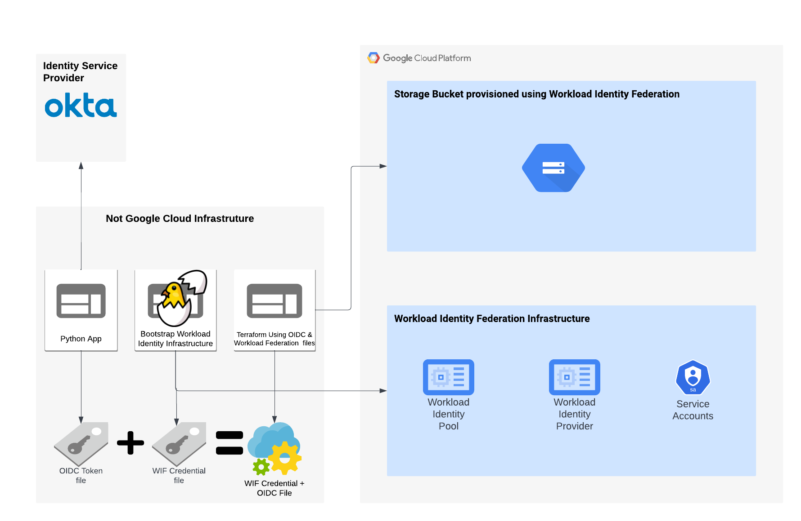

# terraform-google-workload-identity-federation

This module will deploy a Workload Identity Pool, Provider, and Service Account that an external identity will impersonate. In addition, a python script is available to generate an OIDC token.

## Demo Reference Architecture


The resources/services/activations/deletions that this module will create/trigger are:
- Generate an Okta OIDC Token
- Create a Workload Identity Pool
- Create a Workload Identity Provider
- Disable Service Account Key creation in project
- Create a Service Account
- Update IAM Policy to impersonate the new Service Account via attributes/claims

## Prerequisites

### Create Okta Authorization Server
1. Login to Okta admin console
2. Go to Security->API
3. Authorization Server
4. Define a new authorization server, note the issuer URL — you’ll need this to configure OIDC provider in Google Cloud
5. Set audience (could be anything that is mutually verifiable, preferably unique), note the audience — you’ll need this to configure the OIDC provider in Google Cloud
6. Define a new scope, set this scope as a default scope
7. Define a new claim. Customize this claim to your requirement of attribute verification in Google Cloud
8. Go to access policies, make sure its Assigned to “All Clients”

### Collect Okta variables for Google Cloud infrastructure deployment
```
issuer_uri = " Your Okta Authorization server "
subject = " Subject of Okta Client ID "
allowed_audiences = [ " Okta Authorization server allowed audience " ]
```

## Usage
1. Clone repo
```
git clone https://github.com/jasonbisson/terraform-google-workload-identity-federation.git

```

2. Rename and update required variables in terraform.tvfars.template
```
mv terraform.tfvars.template terraform.tfvars
#Update required variables
```
3. Execute Terraform commands with existing identity (human or service account) to build Workload Identity Infrastructure and the Workload Identity Federation credential file
```
cd ~/terraform-google-workload-identity-federation/
terraform init
terraform plan
terraform apply
```

4. Generate Okta OIDC Token file
```
Set required variables in Operating System
export OKTA_AZ_SERVER="https://Your Okta Auth server/v1/token"
export CLIENT_ID="Your Client ID"
export CLIENT_SECRET="Your Client Secret" or export CLIENT_SECRET=$(gcloud secrets versions access latest --project your project id --secret="your secret name")
cd files
python get_oidc_token.py
cat /tmp/okta-token.json
```

5. Deploy Storage Bucket with new Workload Identity credential file
```
cd ~/terraform-google-workload-identity-federation/examples/simple_example
export GOOGLE_APPLICATION_CREDENTIALS="/tmp/sts.json"
#Rename and update required project_id
mv terraform.tfvars.template terraform.tfvars
#Update required variables
terraform init
terraform plan
terraform apply
terraform destroy
unset GOOGLE_APPLICATION_CREDENTIALS
```

6. Confirm Cloud logging audit event for Storage bucket used serviceAccountDelegationInfo
```
export project_id="Project id used to deploy Storage Bucket"
gcloud logging read protoPayload.methodName="storage.buckets.create" --freshness=1d --project=${project_id} --format json |grep principalSubject
```

## Destroy Workload Identity Federation Infrastructure and local token files
1. Execute Terraform destroy command with existing identity (human or service account)
```
unset GOOGLE_APPLICATION_CREDENTIALS
cd ~/terraform-google-workload-identity-federation/
terraform destroy
rm /tmp/sts.json
rm /tmp/okta-token.json
```


<!-- BEGINNING OF PRE-COMMIT-TERRAFORM DOCS HOOK -->
## Inputs

| Name | Description | Type | Default | Required |
|------|-------------|------|---------|:--------:|
| activate\_apis | The list of apis to activate for Cloud Function | `list(string)` | <pre>[<br>  "sts.googleapis.com",<br>  "iamcredentials.googleapis.com",<br>  "cloudresourcemanager.googleapis.com",<br>  "iam.googleapis.com"<br>]</pre> | no |
| allowed\_audiences | Workload Identity Pool Provider allowed audiences | `list(string)` | `[]` | no |
| attribute\_condition | Workload Identity Pool Provider attribute condition expression | `string` | `null` | no |
| attribute\_mapping | Workload Identity Pool Provider attribute mapping | `map(any)` | n/a | yes |
| disable\_dependent\_services | Whether services that are enabled and which depend on this service should also be disabled when this service is destroyed. https://www.terraform.io/docs/providers/google/r/google_project_service.html#disable_dependent_services | `string` | `"false"` | no |
| disable\_services\_on\_destroy | Whether project services will be disabled when the resources are destroyed. https://www.terraform.io/docs/providers/google/r/google_project_service.html#disable_on_destroy | `string` | `"false"` | no |
| enable\_apis | Whether to actually enable the APIs. If false, this module is a no-op. | `string` | `"true"` | no |
| environment | Unique environment name to link the deployment together | `any` | n/a | yes |
| issuer\_uri | Workload Identity Pool Provider issuer URL | `string` | n/a | yes |
| pool\_description | Workload Identity Pool description | `string` | `"Workload Identity Pool managed by Terraform"` | no |
| pool\_disabled | Workload Identity Pool disabled | `bool` | `false` | no |
| pool\_display\_name | Workload Identity Pool display name | `string` | `null` | no |
| pool\_id | Workload Identity Pool ID | `string` | n/a | yes |
| project\_id | Google Cloud Project where Identity pool will be deployed | `any` | n/a | yes |
| provider\_description | Workload Identity Pool Provider description | `string` | `"Workload Identity Pool Provider managed by Terraform"` | no |
| provider\_disabled | Workload Identity Pool Provider disabled | `bool` | `false` | no |
| provider\_display\_name | Workload Identity Pool Provider display name | `string` | `null` | no |
| provider\_id | Workload Identity Pool Provider ID | `string` | n/a | yes |
| subject | External subject to impersonate Service Account | `string` | n/a | yes |

## Outputs

No output.

<!-- END OF PRE-COMMIT-TERRAFORM DOCS HOOK -->

## Requirements

These sections describe requirements for using this module.

### Software

The following dependencies must be available:

- [Terraform][terraform] v0.13
- [Terraform Provider for GCP][terraform-provider-gcp] plugin v3.61 or above

### Infrastructure deployment Account

A account with the following roles must be used to provision
the resources of this module:

- Identity Pool Admin: `roles/iam.workloadIdentityPoolAdmin`
- Security Admin: `roles/iam.securityAdmin`

### APIs

A project with the following APIs enabled must be used to host the
resources of this module:

- Secure Token Service: `sts.googleapis.com`
- IAM Credentials: `iamcredentials.googleapis.com`
- Cloud Resource Manager: `cloudresourcemanager.googleapis.com`
- IAM: `iam.googleapis.com`
- Google Cloud Storage: `storage.googleapis.com`

The [Project Factory module][project-factory-module] can be used to
provision a project with the necessary APIs enabled.

## Contributing

Refer to the [contribution guidelines](./CONTRIBUTING.md) for
information on contributing to this module.

[iam-module]: https://registry.terraform.io/modules/terraform-google-modules/iam/google
[project-factory-module]: https://registry.terraform.io/modules/terraform-google-modules/project-factory/google
[terraform-provider-gcp]: https://www.terraform.io/docs/providers/google/index.html
[terraform]: https://www.terraform.io/downloads.html

## Security Disclosures

Please see our [security disclosure process](./SECURITY.md).

## Troubleshooting

1. Okta OIDC token will time out if the terraform deployment is delayed
